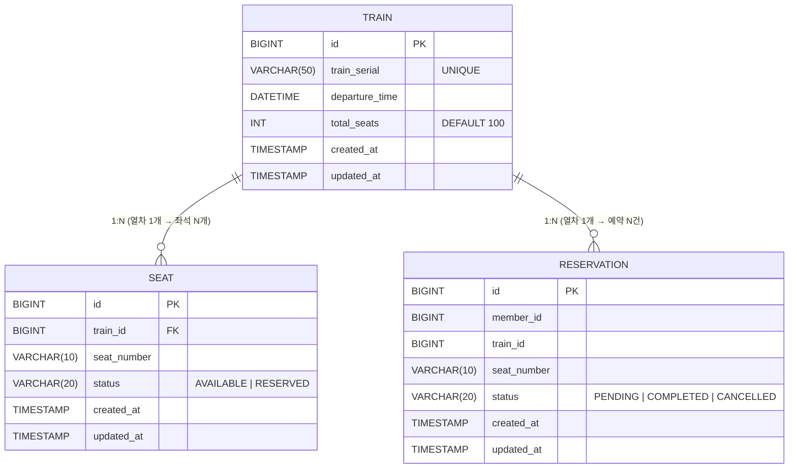

# ERD (Entity Relationship Diagram)

## 1. 테이블 상세 스펙

---

### Train (열차)

| 컬럼명 | 타입 | 제약조건 | 설명 |
|---|---|---|---|
| id | BIGINT | PK, AUTO_INCREMENT | 열차 고유 ID |
| train_serial | VARCHAR(50) | NOT NULL, UNIQUE | 열차 번호 (예: KTX-001) |
| departure_time | DATETIME | NOT NULL | 출발 시간 |
| total_seats | INT | NOT NULL, DEFAULT 100 | 총 좌석 수 |
| created_at | TIMESTAMP | DEFAULT CURRENT_TIMESTAMP | 생성일시 (자동) |
| updated_at | TIMESTAMP | DEFAULT CURRENT_TIMESTAMP ON UPDATE | 수정일시 (자동) |

- Engine: InnoDB
- Charset: utf8mb4

---

### Seat (좌석)

| 컬럼명 | 타입 | 제약조건 | 설명 |
|---|---|---|---|
| id | BIGINT | PK, AUTO_INCREMENT | 좌석 고유 ID |
| train_id | BIGINT | NOT NULL, FK → train(id) | 소속 열차 ID |
| seat_number | VARCHAR(10) | NOT NULL | 좌석 번호 (예: A1, B12) |
| status | VARCHAR(20) | NOT NULL, DEFAULT 'AVAILABLE' | 좌석 상태 (AVAILABLE / RESERVED) |
| created_at | TIMESTAMP | DEFAULT CURRENT_TIMESTAMP | 생성일시 (자동) |
| updated_at | TIMESTAMP | DEFAULT CURRENT_TIMESTAMP ON UPDATE | 수정일시 (자동) |

- Engine: InnoDB
- Charset: utf8mb4
- Unique 제약: `uk_train_seat` (train_id, seat_number) — 동일 열차 내 좌석 번호 중복 불가

---

### Reservation (예약)

| 컬럼명 | 타입 | 제약조건 | 설명 |
|---|---|---|---|
| id | BIGINT | PK, AUTO_INCREMENT | 예약 고유 ID |
| member_id | BIGINT | NOT NULL | 예약자 ID (회원) |
| train_id | BIGINT | NOT NULL | 열차 ID |
| seat_number | VARCHAR(10) | NOT NULL | 좌석 번호 |
| status | VARCHAR(20) | NOT NULL | 예약 상태 (PENDING / COMPLETED / CANCELLED) |
| created_at | TIMESTAMP | DEFAULT CURRENT_TIMESTAMP | 생성일시 (자동) |
| updated_at | TIMESTAMP | DEFAULT CURRENT_TIMESTAMP ON UPDATE | 수정일시 (자동) |

- Engine: InnoDB
- Charset: utf8mb4
- Unique 제약: `uk_train_seat_status` (train_id, seat_number, status)
  - 동일 열차/좌석에 PENDING 또는 COMPLETED 상태 예약이 동시에 2건 이상 존재 불가

---

## 2. Mermaid ERD 다이어그램



> **Note:** Reservation은 seat_id FK 대신 (train_id + seat_number)로 좌석을 참조합니다.
> 이는 Kafka 비동기 처리 시 Seat 엔티티 조회 없이 예약을 INSERT할 수 있도록 하기 위함입니다.

---

## 3. Redis Key 설계

### 3.1 가상 대기열 (ZSET)

| Key 패턴 | 자료구조 | Value | Score | 설명 |
|---|---|---|---|---|
| `train:{trainId}:waiting_queue` | ZSET | userId | System.currentTimeMillis() | 열차별 대기열 |

- **ZADD**: 대기열 진입 시 사용자 등록
- **ZRANK**: 현재 내 순위 조회 (0-based → +1 하여 표시)
- **ZPOPMIN N**: 스케줄러가 상위 N명을 Active Pool로 전환
- **TTL**: 별도 만료 없음 (스케줄러가 관리)

---

### 3.2 좌석 캐시 (Hash / Bitmap)

| Key 패턴 | 자료구조 | Field | Value | 설명 |
|---|---|---|---|---|
| `train:{trainId}:seats` | Hash | seat_number | AVAILABLE / RESERVED | 잔여 좌석 O(1) 조회 |

- 열차 최초 조회 또는 서버 기동 시 DB → Redis 동기화 (Cache Aside)
- 예약 완료(COMPLETED) 시 HSET으로 해당 좌석 상태를 RESERVED로 갱신
- 예약 취소(CANCELLED) 시 HSET으로 AVAILABLE 복원

---

### 3.3 분산 락 (Redisson String)

| Key 패턴 | 자료구조 | Value | TTL | 설명 |
|---|---|---|---|---|
| `lock:seat:{trainId}:{seatNumber}` | String | userId | 300초 (5분) | 좌석 선점 분산 락 |

- Redisson Pub/Sub 기반 → 스핀락 대비 CPU 효율 높음
- 락 획득 실패 시 즉시 409 Conflict 반환 (대기 없음)
- TTL 300초: 결제 미완료 시 자동 락 해제 → Compensation Transaction 트리거

---

## 4. 비즈니스 규칙

### 4.1 예약 중복 방지
- 동일한 (train_id, seat_number)에 대해 **PENDING 또는 COMPLETED 상태의 예약은 최대 1건**만 허용
- DB 레벨: `uk_train_seat_status` Unique Key로 보장
- 애플리케이션 레벨: Redisson 분산 락으로 중복 요청 원천 차단

### 4.2 대기열 순서 보장
- ZSET Score를 `System.currentTimeMillis()`로 설정하여 **선착순(FIFO)** 보장
- ZPOPMIN을 통해 낮은 Score(이른 진입 시각) 순으로 Active Pool 전환
- 동일 Score(동시 진입)의 경우 Redis 내부 사전순 정렬로 처리

### 4.3 좌석 상태 전이
```
AVAILABLE → (분산 락 획득 + Kafka 발행) → PENDING
PENDING   → (결제 완료)                  → COMPLETED
PENDING   → (5분 이내 결제 없음)          → CANCELLED
RESERVED  상태는 seat 테이블 전용 (AVAILABLE ↔ RESERVED)
```

### 4.4 Compensation Transaction (보상 트랜잭션)
- PENDING 상태로 5분 경과 시 `@Scheduled` 배치가 자동으로 CANCELLED 처리
- Redis Lock TTL(300s) 만료와 동기화되어 Lock도 함께 해제됨
- CANCELLED 처리 후 seat 테이블의 status도 AVAILABLE로 복원

### 4.5 DB Connection Pool 보호
- 분산 락 획득 실패 → 즉시 409 반환 (DB I/O 없음)
- 락 획득 성공 후에도 Kafka 발행 → Consumer에서 DB INSERT
- Consumer의 Concurrency 설정으로 DB 쓰기 속도 조절 (DB Connection 과부하 방지)

### 4.6 열차 좌석 수 제한
- 열차 1대당 총 100석 (`total_seats = 100`)
- Seat 테이블에 100개 Row 사전 생성 (초기 데이터)
- RESERVED 좌석 수가 100개에 도달하면 해당 열차 예약 불가
