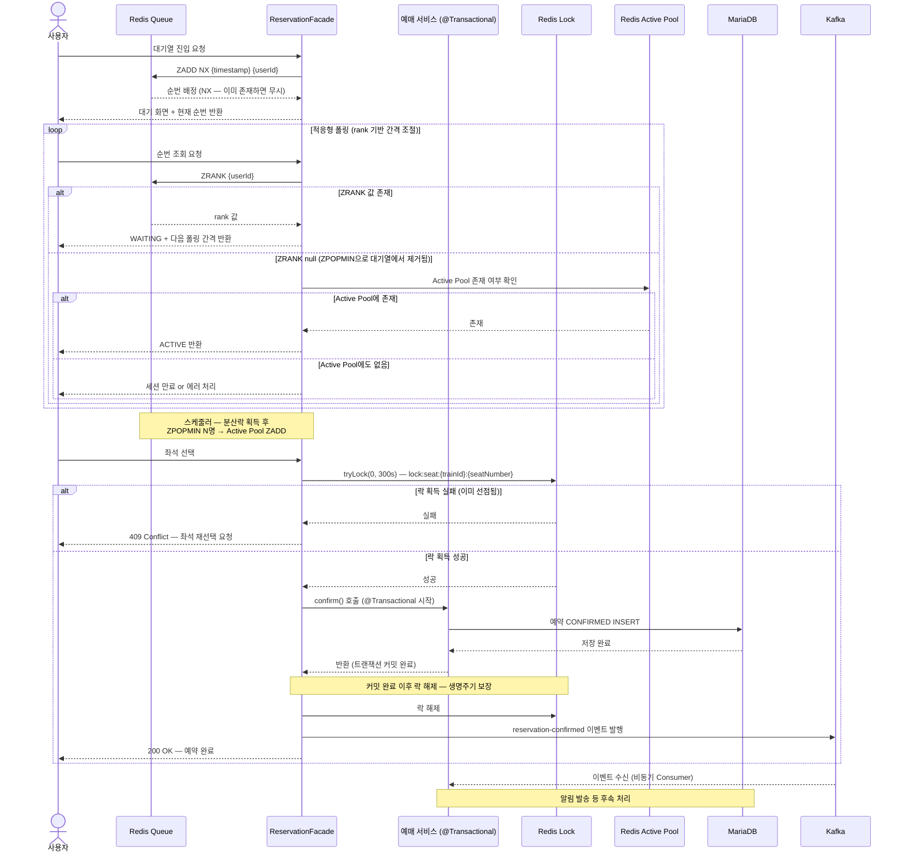

# TRD (Technical Requirements Document)

## 0. 메타데이터

| 항목 | 내용 |
|---|---|
| 문서 유형 | Technical Requirements Document (TRD) |
| 도메인 | 티켓팅 / 예약 시스템 |
| 규모 | 열차 1대 (100석), 극한 동시 트래픽 |
| 핵심 제약 | MariaDB, Redis, Kafka (모두 Docker 운영), 가상 대기열, 초과 예약 없음, DB Connection Pool 고갈 없음 |
| 핵심 기술 | Spring Boot, Redis (ZSET + Redisson), Apache Kafka, MariaDB, Docker, Spring REST Docs, 적응형 폴링 |

---

## 1. 아키텍처 흐름

### 1.0 아키텍처 개요

| 컴포넌트 | 역할 |
|---|---|
| Redis Queue | 대기열 순번 관리 (ZADD NX — 선착순 보장) |
| Redis Active Pool | Active 유저 관리 (ZSET — 만료 시각 기반) |
| Redis Lock | 좌석 선점 (Redisson, TTL 5분) |
| 예매 서비스 | 비즈니스 로직 처리 |
| Reservation Facade | 분산 락 생명주기 관리 (트랜잭션 커밋 이후 락 해제 보장) |
| Kafka | 예약 확정 이벤트 발행 (비동기 후속 처리) |
| MariaDB | 예약 저장 |
| 적응형 폴링 | 순번 조회 (rank 기반 간격 동적 조절) |

### 1.1 전체 시퀀스 다이어그램



### 1.2 흐름 요약

| 단계 | 설명 |
|---|---|
| 대기열 진입 | `ZADD NX`로 등록 — NX 옵션으로 선착순 보장, 재진입 시 기존 순번 유지 |
| 순번 대기 | 적응형 폴링 — rank 기반 간격 조절, ZRANK null 시 Active Pool 확인 후 상태 판단 |
| Active 전환 | 스케줄러가 분산락 획득 → `ZPOPMIN` N명 → Active Pool `ZADD` (score = 만료 시각) |
| 좌석 선점 | Facade에서 Redisson `tryLock(0, 300s)` 획득 — 실패 시 즉시 409 |
| 예약 확정 | Facade → `@Transactional` 서비스 호출 → 커밋 완료 후 Facade에서 락 해제 |
| 비동기 후속 처리 | Kafka Consumer — 알림 발송 등 부가 작업 |

---

## 2. 기술 스택

| 분류 | 기술 | 버전 / 비고 |
|---|---|---|
| 언어 | Java | 17 |
| 프레임워크 | Spring Boot | 3.x |
| 데이터베이스 | MariaDB | Docker (mariadb:latest) |
| 인메모리 저장소 | Redis | Docker (redis:alpine), ZSET + Redisson |
| 메시지 큐 | Apache Kafka | Docker, KRaft 모드 (Zookeeper 없음) |
| 실시간 통신 | 적응형 폴링 | rank 기반 동적 간격 조절 |
| 인프라 | Docker / Docker Compose | Bridge Network |
| API 문서화 | Spring REST Docs | 테스트 기반 문서 자동 생성 |

---

## 3. 데이터 모델

### 3.1 Redis ZSET — 가상 대기열

| 항목 | 내용 |
|---|---|
| Key | `train:{trainId}:waiting_queue` |
| Value | userId (String) |
| Score | `System.currentTimeMillis()` (진입 시각 — 낮을수록 먼저) |

```
ZADD train:{trainId}:waiting_queue NX {timestamp} {userId}
```

> **NX 옵션이 핵심이다.**
> - NX 없음: 재진입 시 timestamp가 갱신되어 순번이 뒤로 밀림 → 선착순 파괴
> - NX 있음: 이미 존재하는 userId는 무시 → 최초 진입 시각 기준 순번 영구 고정

**주요 명령어**

| 명령어 | 용도 |
|---|---|
| `ZADD NX {score} {userId}` | 대기열 최초 진입 (이미 존재하면 무시) |
| `ZRANK {userId}` | 현재 순위 조회 (0-based, null이면 대기열에 없음) |
| `ZPOPMIN {N}` | 상위 N명 꺼내기 (Active 전환 시) |
| `ZREM {userId}` | 대기열 이탈 (취소 시) |
| `ZCARD` | 전체 대기 인원 수 조회 |

---

### 3.2 Redis — Active Pool

| 항목 | 내용 |
|---|---|
| Key | `train:{trainId}:active_pool` |
| 자료구조 | ZSET |
| Value | userId |
| Score | `System.currentTimeMillis() + 600_000` (만료 시각 = 진입 시각 + 10분) |
| 용도 | Active 인원 수 O(1) 조회, 만료 유저 일괄 제거 |

**개별 String Key 방식을 사용하지 않는 이유:**

개별 Key(`train:{trainId}:active:{userId}`) 방식으로는 현재 Active 인원을 세려면
`KEYS train:{trainId}:active:*`를 사용해야 하는데, 이는 Redis 싱글 스레드를 블로킹하여
전체 장애를 유발한다. `SCAN`으로 대체해도 로직이 복잡하고 느리다.

**ZSET 방식의 장점:**

| 명령어 | 용도 | 시간 복잡도 |
|---|---|---|
| `ZADD {expireTs} {userId}` | Active Pool 등록 | O(log N) |
| `ZCARD` | 현재 Active 인원 수 조회 | O(1) |
| `ZSCORE {userId}` | 특정 유저 Active 여부 확인 | O(1) |
| `ZREMRANGEBYSCORE 0 {now}` | 만료된 유저 일괄 제거 | O(log N + K) |

**Active Pool 슬롯 계산:**

```
투입 가능 인원 = DB Connection Pool 크기 - ZCARD(active_pool)
스케줄러는 이 값만큼만 ZPOPMIN 수행
```

**만료 처리:**

```
스케줄러 실행 시:
  1. ZREMRANGEBYSCORE train:{trainId}:active_pool 0 {currentTimeMillis}
     → 만료된 유저 일괄 제거
  2. ZCARD로 현재 인원 파악
  3. 빈 슬롯만큼 waiting_queue에서 ZPOPMIN → active_pool ZADD
```

---

### 3.3 Redis — 분산 락

**스케줄러 분산 락**

| 항목 | 내용 |
|---|---|
| Key | `lock:scheduler:queue-processor` |
| 용도 | 다중 서버 환경에서 스케줄러 중복 실행 방지 |
| 방식 | `tryLock(0, leaseTime, TimeUnit)` — 획득 실패 인스턴스는 skip |

**좌석 선점 분산 락**

| 항목 | 내용 |
|---|---|
| Key | `lock:seat:{trainId}:{seatNumber}` |
| Value | userId (Redisson 내부 관리) |
| TTL | 300초 (5분) |
| 용도 | 동일 좌석 동시 선점 방지 (초과 예약 1차 방어) |
| 해제 주체 | ReservationFacade — 트랜잭션 커밋 완료 이후에만 해제 |

> **Watchdog 비활성화 필수**
>
> Redisson은 `leaseTime`을 생략하면 Watchdog이 TTL을 자동 연장한다.
> 5분 자동 해제가 동작하려면 반드시 `leaseTime`을 명시해야 한다.
>
> ```java
> // 올바른 사용 — leaseTime 명시 시 Watchdog 비활성화
> lock.tryLock(0, 300, TimeUnit.SECONDS);
>
> // 잘못된 사용 — leaseTime 생략 시 Watchdog이 TTL 무한 연장
> lock.tryLock();
> ```

---

### 3.4 분산 락 적용 위치 정리

| 락 키 | 적용 시점 | 해제 주체 |
|---|---|---|
| `lock:scheduler:queue-processor` | 스케줄러 실행 시 | 스케줄러 종료 후 |
| `lock:seat:{trainId}:{seatNumber}` | 좌석 선점 요청 시 (Facade) | 트랜잭션 커밋 완료 후 Facade에서 해제 |

> **대기열 진입(`ZADD NX`)에는 분산락 불필요**
> Redis 단일 명령어는 원자적으로 실행되며, NX 옵션이 중복 등록을 처리한다.

---

### 3.5 MariaDB 스키마

```sql
-- 열차 테이블
CREATE TABLE train (
    id             BIGINT AUTO_INCREMENT PRIMARY KEY,
    train_serial   VARCHAR(50)  NOT NULL UNIQUE COMMENT '열차 번호',
    departure_time DATETIME     NOT NULL         COMMENT '출발 시간',
    total_seats    INT          NOT NULL DEFAULT 100 COMMENT '총 좌석 수',
    created_at     TIMESTAMP    DEFAULT CURRENT_TIMESTAMP,
    updated_at     TIMESTAMP    DEFAULT CURRENT_TIMESTAMP ON UPDATE CURRENT_TIMESTAMP
) ENGINE=InnoDB DEFAULT CHARSET=utf8mb4;

-- 좌석 테이블
CREATE TABLE seat (
    id          BIGINT AUTO_INCREMENT PRIMARY KEY,
    train_id    BIGINT      NOT NULL COMMENT '열차 ID (FK)',
    seat_number VARCHAR(10) NOT NULL COMMENT '좌석 번호',
    status      VARCHAR(20) NOT NULL DEFAULT 'AVAILABLE' COMMENT 'AVAILABLE | RESERVED',
    created_at  TIMESTAMP   DEFAULT CURRENT_TIMESTAMP,
    updated_at  TIMESTAMP   DEFAULT CURRENT_TIMESTAMP ON UPDATE CURRENT_TIMESTAMP,
    UNIQUE KEY uk_train_seat (train_id, seat_number),
    FOREIGN KEY (train_id) REFERENCES train(id)
) ENGINE=InnoDB DEFAULT CHARSET=utf8mb4;

-- 예약 테이블
CREATE TABLE reservation (
    id          BIGINT AUTO_INCREMENT PRIMARY KEY,
    member_id   BIGINT      NOT NULL COMMENT '예약자 ID',
    train_id    BIGINT      NOT NULL COMMENT '열차 ID',
    seat_number VARCHAR(10) NOT NULL COMMENT '좌석 번호',
    status      VARCHAR(20) NOT NULL COMMENT 'CONFIRMED | CANCELLED',
    created_at  TIMESTAMP   DEFAULT CURRENT_TIMESTAMP,
    updated_at  TIMESTAMP   DEFAULT CURRENT_TIMESTAMP ON UPDATE CURRENT_TIMESTAMP,
    UNIQUE KEY uk_train_seat (train_id, seat_number), -- 초과 예약 2차 방어
    FOREIGN KEY (train_id) REFERENCES train(id)
) ENGINE=InnoDB DEFAULT CHARSET=utf8mb4;
```

**초과 예약 이중 방어 구조**

| 방어 계층 | 수단 | 동작 |
|---|---|---|
| 1차 | Redisson 분산 락 | tryLock 실패 → 즉시 409 반환, DB 접근 없음 |
| 2차 | DB Unique Key (`train_id + seat_number`) | 락 만료 등 극단적 상황의 최후 안전망 |

---

## 4. 고동시성 처리 설계

### 4.1 가상 대기열 (Virtual Waiting Room)

**목적:** 폭발적인 동시 요청이 DB에 직접 도달하는 것을 방지

**동작 방식:**

1. `ZADD NX {timestamp} {userId}` — 최초 진입 시각 기준 순번 고정
2. 스케줄러가 `lock:scheduler:queue-processor` 분산락 획득
3. `ZREMRANGEBYSCORE active_pool 0 {now}` 로 만료 유저 먼저 정리
4. `ZCARD active_pool` 로 현재 인원 파악 → 빈 슬롯 계산
5. 빈 슬롯 수만큼만 `ZPOPMIN` → `active_pool ZADD score={expireTs}`

**Active Pool 크기 기준:**

```
빈 슬롯 = DB Connection Pool 크기 - ZCARD(active_pool)
투입 인원 = MIN(빈 슬롯, ZCARD(waiting_queue))
```

---

### 4.2 적응형 폴링 (Adaptive Polling)

**목적:** 순번이 가까워질수록 폴링 간격을 줄여 응답성 향상, 불필요한 요청은 줄여 서버 부하 절감

**폴링 간격 기준 (ZRANK 결과 기반):**

| rank 범위 | 폴링 간격 | 비고 |
|---|---|---|
| 100 이상 | 10초 | 오래 기다려야 함 |
| 10 ~ 99 | 5초 | 기본 간격 |
| 3 ~ 9 | 2초 | 곧 순번 도달 |
| 1 ~ 2 | 1초 | 직전 대기 |
| null | Active Pool 확인 | ZPOPMIN으로 대기열에서 제거된 상태 |

> `ZRANK`는 O(log N) Redis 메모리 연산이므로 폴링이 잦아도 서버 부하가 낮다.

**ZRANK null 처리 로직 (필수):**

`ZPOPMIN` 실행 후 해당 유저는 waiting_queue에서 삭제된다.
다음 폴링 시 `ZRANK`는 null을 반환하므로 반드시 아래 분기 처리가 필요하다.

```
ZRANK 조회
  ├─ 값 존재 → rank 기반 폴링 간격 반환 (WAITING)
  └─ null
       ├─ ZSCORE active_pool {userId} 존재 → ACTIVE 반환
       └─ 없음 → 세션 만료 또는 비정상 접근 → 에러 처리 (재진입 유도)
```

**폴링 응답 구조:**

```json
// WAITING 상태
{
  "status": "WAITING",
  "rank": 15,
  "pollingIntervalMs": 5000
}

// ACTIVE 전환
{
  "status": "ACTIVE"
}

// 세션 만료
{
  "status": "EXPIRED"
}
```

---

### 4.3 Facade 패턴 — 트랜잭션·락 생명주기 분리

**목적:** `@Transactional` 커밋 이후에 락이 해제되도록 생명주기 보장

**문제:**

Spring `@Transactional`은 AOP 프록시로 동작한다.
서비스 메서드 내에서 락을 획득·해제하면, 코드상 락 해제가 먼저 실행되고
트랜잭션 커밋은 프록시가 메서드 반환 후에 수행한다.
락이 풀린 찰나에 다른 스레드가 진입해 미커밋 데이터를 읽고 중복 예약을 시도할 수 있다.

```
[잘못된 구조]
@Transactional
reservationService.confirm() {
    lock.tryLock()
    // DB INSERT
    lock.unlock()   ← 락 해제 (트랜잭션은 아직 열려 있음)
}                   ← 트랜잭션 커밋 (락 해제 이후 → 취약 구간 발생)
```

**해결: Facade 패턴**

락은 Facade(비트랜잭션)에서 관리하고, 내부 서비스(@Transactional)가 커밋을 완료한 뒤 반환되면 그때 락을 해제한다.

```
[올바른 구조]
ReservationFacade (락 담당, @Transactional 없음) {
    lock.tryLock()
    try {
        reservationService.confirm()  ← @Transactional, 여기서 커밋까지 완료
    } finally {
        lock.unlock()  ← 커밋 완료 이후 해제 보장
    }
}
```

**레이어 구조:**

```
Controller
    └─ ReservationFacade     ← 락 획득/해제, @Transactional 없음
           └─ ReservationService  ← 비즈니스 로직, @Transactional
                  └─ ReservationRepository (JPA)
```

---

### 4.4 좌석 선점 전체 흐름

```
좌석 선택 요청 (ReservationFacade)
  └─ Active Pool 검증 (ZSCORE — 해당 유저가 Active 상태인지 확인)
  └─ tryLock(0, 300, SECONDS)
      ├─ 실패 → 409 Conflict 즉시 반환 (DB 접근 없음)
      └─ 성공
           └─ reservationService.confirm() 호출 (@Transactional)
                └─ 예약 CONFIRMED INSERT
                └─ seat.status RESERVED UPDATE
           └─ 트랜잭션 커밋 완료 후 반환
           └─ lock.unlock()  ← 커밋 이후 해제
           └─ Kafka reservation-confirmed 발행
           └─ 200 OK
```

---

### 4.5 Write-Behind 패턴 (Kafka)

**목적:** 예약 확정 후 알림 발송 등 부가 작업을 비동기로 처리

**토픽 설계:**

| 토픽 | 발행 시점 | 소비 처리 |
|---|---|---|
| `reservation-confirmed` | 락 해제 이후 (Facade) | 알림 발송 등 후속 처리 |

> 후속 처리가 없다면 Kafka 제거를 검토할 수 있다.

---

## 5. API 명세 요약

> 상세 명세는 `docs/api.md` 참조

| 메서드 | 경로 | 설명 | 주요 기술 |
|---|---|---|---|
| POST | `/api/v1/queue/join` | 대기열 진입 | Redis `ZADD NX` |
| GET | `/api/v1/queue/status` | 순번 조회 (적응형 폴링) | Redis `ZRANK` → null 시 `ZSCORE active_pool` 확인 |
| GET | `/api/v1/trains/{trainId}/seats` | 잔여 좌석 조회 | Redis Hash (Cache Aside) |
| POST | `/api/v1/reservations` | 좌석 선점 및 예약 확정 | ReservationFacade, Redisson 분산 락, MariaDB INSERT |
| DELETE | `/api/v1/queue/leave` | 대기열 이탈 | Redis `ZREM` |

---

## 6. Docker Compose 구성

### 6.1 서비스 목록

| 서비스 | 이미지 | 포트 | 비고 |
|---|---|---|---|
| Redis | `redis:alpine` | 6379 | ZSET 대기열, Active Pool, Redisson 분산 락 |
| Kafka | `bitnami/kafka` (KRaft) | 9092 | Zookeeper 없음 |
| MariaDB | `mariadb:latest` | 3306 | 예약 데이터 영구 저장 |

### 6.2 Docker Compose

```yaml
version: '3.8'

services:
  redis:
    image: redis:alpine
    container_name: ticket-redis
    ports:
      - "6379:6379"
    networks:
      - train-network

  kafka:
    image: bitnami/kafka:latest
    container_name: ticket-kafka
    ports:
      - "9092:9092"
    environment:
      - KAFKA_CFG_NODE_ID=1
      - KAFKA_CFG_PROCESS_ROLES=broker,controller
      - KAFKA_CFG_LISTENERS=PLAINTEXT://:9092,CONTROLLER://:9093
      - KAFKA_CFG_ADVERTISED_LISTENERS=PLAINTEXT://localhost:9092
      - KAFKA_CFG_LISTENER_SECURITY_PROTOCOL_MAP=CONTROLLER:PLAINTEXT,PLAINTEXT:PLAINTEXT
      - KAFKA_CFG_CONTROLLER_QUORUM_VOTERS=1@kafka:9093
      - KAFKA_CFG_CONTROLLER_LISTENER_NAMES=CONTROLLER
    networks:
      - train-network

  mariadb:
    image: mariadb:latest
    container_name: ticket-mariadb
    ports:
      - "3306:3306"
    environment:
      MYSQL_ROOT_PASSWORD: root
      MYSQL_DATABASE: ticket
      MYSQL_USER: ticket
      MYSQL_PASSWORD: ticket
    networks:
      - train-network

networks:
  train-network:
    driver: bridge
```

---

## 7. 비기능 요구사항

| 항목 | 요구사항 |
|---|---|
| 초과 예약 방지 | Redisson 분산 락 (1차) + DB Unique Key (2차) 이중 방어 |
| 선착순 보장 | `ZADD NX` — 최초 진입 시각 고정, 재진입 시 순번 변경 불가 |
| 트랜잭션·락 정합성 | Facade 패턴 — 트랜잭션 커밋 완료 후 락 해제 보장 |
| DB Connection Pool 보호 | Active Pool 크기 ≤ DB Connection Pool 크기, 락 실패 즉시 반환 |
| Active Pool 정원 관리 | ZSET `ZCARD` O(1) 조회, `ZREMRANGEBYSCORE`로 만료 유저 일괄 정리 |
| 서버 부하 절감 | 적응형 폴링 — rank 기반 간격 동적 조절, ZRANK null 분기 처리 |
| 장애 복구 | Active Pool ZSET score 만료 기반 자동 정리 |
| 문서화 | Spring REST Docs (테스트 기반 자동 생성) |