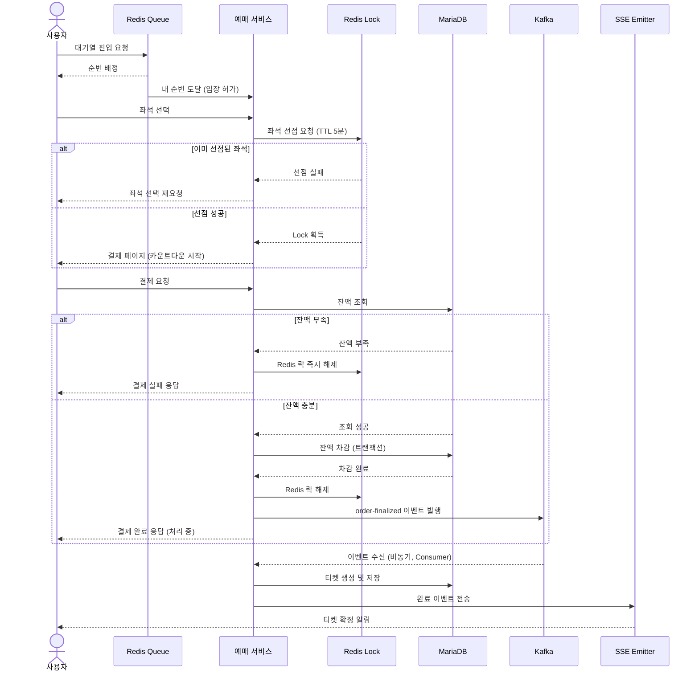

# TRD (Technical Requirements Document)

## 0. 메타데이터

| 항목 | 내용 |
|---|---|
| 문서 유형 | Technical Requirements Document (TRD) |
| 도메인 | 티켓팅 / 예약 시스템 |
| 규모 | 열차 1대 (100석), 극한 동시 트래픽 |
| 핵심 제약 | MariaDB, Redis, Kafka (모두 Docker 운영), 가상 대기열, 초과 예약 없음, DB Connection Pool 고갈 없음 |
| 핵심 기술 | Spring Boot, Redis (ZSET), Apache Kafka, MariaDB, Docker, Spring REST Docs, SSE, Outbox 패턴 |

---

## 1. 아키텍처 흐름

### 1.0 아키텍처 개요

| 컴포넌트 | 역할 |
|---|---|
| Redis Queue | 대기열 순번 관리 |
| Redis Lock | 좌석 선점 (TTL 5분) |
| 예매 서비스 | 비즈니스 로직 처리 |
| Kafka | 결제 완료 이벤트 발행 (비동기) |
| MariaDB | 회원 잔액, 예약, 티켓 생성 및 저장 |
| SSE | 순번 조회 + 티켓 확정 알림 |

### 1.1 전체 시퀀스 다이어그램



### 1.2 흐름 요약

| 단계 | 설명 |
|---|---|
| 대기열 진입 | Redis ZSET에 사용자 등록, UUID 토큰 발급 |
| 순번 대기 | SSE로 실시간 ZRANK 결과 push |
| Active 전환 | 스케줄러가 상위 N명을 ZPOPMIN으로 꺼내 Active Pool에 등록 |
| 좌석 선점 | Redis Lock 획득 (TTL 5분) → 결제 페이지 이동 |
| 결제 (잔액 차감) | 잔액 조회 → 차감(트랜잭션) → Lock 해제 → Kafka 이벤트 발행 → 202 Accepted |
| 티켓 생성 | Kafka Consumer가 이벤트 소비 → MariaDB에 티켓 INSERT |
| SSE 알림 | 티켓 확정 알림을 SSE로 사용자에게 push |

---

## 2. 기술 스택

| 분류 | 기술 | 버전 / 비고 |
|---|---|---|
| 언어 | Java | 17 |
| 프레임워크 | Spring Boot | 3.x |
| 데이터베이스 | MariaDB | Docker (mariadb:latest) |
| 인메모리 저장소 | Redis | Docker (redis:alpine), ZSET + Redisson |
| 메시지 큐 | Apache Kafka | Docker, KRaft 모드 (Zookeeper 없음) |
| 실시간 통신 | SSE (Server-Sent Events) | Spring SseEmitter |
| 인프라 | Docker / Docker Compose | Bridge Network |
| API 문서화 | Spring REST Docs | 테스트 기반 문서 자동 생성 |

---

## 3. 데이터 모델

### 3.1 Redis ZSET — 가상 대기열

| 항목 | 내용 |
|---|---|
| Key | `train:{trainId}:waiting_queue` |
| Value | userId (String) |
| Score | `System.currentTimeMillis()` (진입 시각) |

**주요 명령어**

| 명령어 | 용도 |
|---|---|
| `ZADD train:{trainId}:waiting_queue {score} {userId}` | 대기열 진입 |
| `ZRANK train:{trainId}:waiting_queue {userId}` | 현재 순위 조회 (0-based) |
| `ZPOPMIN train:{trainId}:waiting_queue {N}` | 상위 N명 Active 전환 |
| `ZREM train:{trainId}:waiting_queue {userId}` | 대기열 이탈 (취소 시) |

---

### 3.2 Redis — 좌석 캐시 및 분산 락

**좌석 캐시 (Hash)**

| 항목 | 내용 |
|---|---|
| Key | `train:{trainId}:seats` |
| 자료구조 | Hash |
| Field | seat_number (예: A1, B12) |
| Value | `AVAILABLE` / `RESERVED` |
| 용도 | 잔여 좌석 O(1) 조회 (Cache Aside) |

**분산 락 (Redisson String)**

| 항목 | 내용 |
|---|---|
| Key | `lock:seat:{trainId}:{seatNumber}` |
| 자료구조 | String |
| Value | userId |
| TTL | 300초 (5분) — 결제 미완료 시 자동 해제 |
| 용도 | 동일 좌석에 단 1명만 선점 허용 |

---

### 3.3 MariaDB 스키마

```sql
-- 열차 테이블
CREATE TABLE train (
    id             BIGINT AUTO_INCREMENT PRIMARY KEY,
    train_serial   VARCHAR(50)  NOT NULL UNIQUE COMMENT '열차 번호',
    departure_time DATETIME     NOT NULL         COMMENT '출발 시간',
    total_seats    INT          NOT NULL DEFAULT 100 COMMENT '총 좌석 수',
    created_at     TIMESTAMP    DEFAULT CURRENT_TIMESTAMP,
    updated_at     TIMESTAMP    DEFAULT CURRENT_TIMESTAMP ON UPDATE CURRENT_TIMESTAMP
) ENGINE=InnoDB DEFAULT CHARSET=utf8mb4;

-- 좌석 테이블
CREATE TABLE seat (
    id          BIGINT AUTO_INCREMENT PRIMARY KEY,
    train_id    BIGINT      NOT NULL COMMENT '열차 ID (FK)',
    seat_number VARCHAR(10) NOT NULL COMMENT '좌석 번호',
    status      VARCHAR(20) NOT NULL DEFAULT 'AVAILABLE' COMMENT 'AVAILABLE, RESERVED',
    created_at  TIMESTAMP   DEFAULT CURRENT_TIMESTAMP,
    updated_at  TIMESTAMP   DEFAULT CURRENT_TIMESTAMP ON UPDATE CURRENT_TIMESTAMP,
    UNIQUE KEY uk_train_seat (train_id, seat_number),
    FOREIGN KEY (train_id) REFERENCES train(id)
) ENGINE=InnoDB DEFAULT CHARSET=utf8mb4;

-- 예약 테이블
CREATE TABLE reservation (
    id          BIGINT AUTO_INCREMENT PRIMARY KEY,
    member_id   BIGINT      NOT NULL COMMENT '예약자 ID',
    train_id    BIGINT      NOT NULL COMMENT '열차 ID',
    seat_number VARCHAR(10) NOT NULL COMMENT '좌석 번호',
    status      VARCHAR(20) NOT NULL COMMENT 'PENDING, COMPLETED, CANCELLED',
    created_at  TIMESTAMP   DEFAULT CURRENT_TIMESTAMP,
    updated_at  TIMESTAMP   DEFAULT CURRENT_TIMESTAMP ON UPDATE CURRENT_TIMESTAMP,
    UNIQUE KEY uk_train_seat_status (train_id, seat_number, status)
) ENGINE=InnoDB DEFAULT CHARSET=utf8mb4;
```

```sql
-- 회원 테이블 (잔액 컬럼 포함)
ALTER TABLE member ADD COLUMN balance DECIMAL(15,2) NOT NULL DEFAULT 0 COMMENT '잔액';

-- 티켓 테이블 (Kafka Consumer가 생성)
CREATE TABLE ticket (
    id             BINARY(16)   NOT NULL PRIMARY KEY               COMMENT 'UUID v7',
    reservation_id BIGINT       NOT NULL                           COMMENT '예약 ID (FK)',
    member_id      BINARY(16)   NOT NULL                           COMMENT '회원 ID (FK)',
    train_id       BIGINT       NOT NULL                           COMMENT '열차 ID',
    seat_number    VARCHAR(10)  NOT NULL                           COMMENT '좌석 번호',
    issued_at      TIMESTAMP    DEFAULT CURRENT_TIMESTAMP          COMMENT '티켓 발급 시각',
    FOREIGN KEY (reservation_id) REFERENCES reservation(id),
    FOREIGN KEY (member_id)      REFERENCES member(id)
) ENGINE=InnoDB DEFAULT CHARSET=utf8mb4;
```

**테이블 관계**

- `train` 1 : N `seat` — 열차 1대에 좌석 N개
- `train` 1 : N `reservation` — 열차 1대에 예약 N건
- `reservation` 1 : 1 `ticket` — 결제 완료된 예약에 티켓 발급
- `reservation`은 `train_id + seat_number`로 좌석을 참조 (seat_id FK 미사용)
- `member.balance` — 결제 시 동기적으로 차감, MariaDB 단일 인스턴스에서 관리

---

## 4. 고동시성 처리 설계

### 4.1 가상 대기열 (Virtual Waiting Room)

**목적:** 폭발적인 동시 요청이 DB에 직접 도달하는 것을 방지

**동작 방식:**
1. 사용자가 대기열 진입 시 Redis ZSET에 등록 (O(log N))
2. SSE 연결을 통해 클라이언트에 실시간 순번 push
3. 스케줄러(`@Scheduled`)가 주기적으로 상위 N명을 Active Pool로 전환
4. Active 상태 사용자만 예약 API 호출 가능

**Active Pool 크기 조절:**
- Active Pool 크기 = DB Connection Pool 크기 이내로 제한
- 트래픽 폭주 시에도 DB Connection 고갈 방지

---

### 4.2 선점 유효성 검사 및 분산 락 (Pre-validation & Lock)

**목적:** 동일 좌석에 대한 중복 예약 원천 차단

**동작 방식:**
1. 예약 API 호출 시 Redisson `tryLock(0, TimeUnit.SECONDS)` 수행
2. **락 획득 실패** → 즉시 **409 Conflict** 반환 (DB I/O 전혀 없음)
3. **락 획득 성공** → 이후 로직(Kafka 발행) 진행
4. TTL 300초로 결제 미완료 시 자동 해제

**Redisson Pub/Sub 방식 선택 이유:**
- 스핀락(busy-wait) 대비 CPU 자원 낭비 없음
- 여러 서버 인스턴스에서도 정확한 상호 배제 보장

---

### 4.3 Write-Behind 패턴 (Kafka)

**목적:** DB 직접 INSERT 대신 Kafka를 버퍼로 활용하여 DB 쓰기 부하 조절

**동작 방식:**
1. 락 획득 성공 → DB INSERT 없이 Kafka 토픽(`reservation.request`) 발행
2. API는 즉시 **202 Accepted** 반환 (응답 지연 최소화)
3. Kafka Consumer가 메시지를 소비하여 DB에 `PENDING` 상태로 INSERT
4. Consumer의 `concurrency` 설정으로 DB 쓰기 속도 조절 가능

**토픽 설계:**

| 토픽 | 발행 시점 | 소비 처리 |
|---|---|---|
| `reservation.request` | 좌석 선점 요청 시 | Reservation PENDING INSERT |

---

### 4.4 보상 트랜잭션 (Compensation Transaction)

**목적:** 결제 미완료 예약을 자동으로 롤백하여 좌석 반환

**동작 방식:**
1. PENDING 상태의 예약이 생성된 후 5분 이내 결제 없으면:
   - Redisson Lock TTL(300s) 만료 → 분산 락 자동 해제
   - `@Scheduled` 배치 Job → 해당 예약의 status를 `CANCELLED`로 업데이트
   - Seat 테이블의 status를 `AVAILABLE`로 복원
   - Redis 좌석 캐시 갱신

**처리 순서:**
```
PENDING 생성 (T+0)
       ↓
결제 미완료 (T+5분)
       ↓
Redis Lock TTL 만료 → lock 자동 삭제
       ↓
@Scheduled 배치 실행
       ↓
Reservation.status = CANCELLED
Seat.status = AVAILABLE
Redis seats cache 갱신
```

---

### 4.5 잔액 차감 타이밍

**목적:** 결제 결과를 사용자에게 즉시 응답하고, 실패 시 보상 트랜잭션 복잡도를 최소화

**동작 방식:**
- 잔액 차감은 Kafka 이벤트 발행 **이전에 동기적으로** 처리
- 차감 성공 → Kafka 발행 → `202 Accepted` 반환
- 차감 실패(잔액 부족) → Redis Lock 즉시 해제 → `400 Bad Request` 반환

---

### 4.6 Redis Lock 수동 해제

**목적:** 결제 실패 시 다른 사용자가 즉시 좌석을 선점할 수 있도록 처리

**동작 방식:**
- 결제 실패(잔액 부족 등) → Lock을 TTL 만료 전에 즉시 수동 해제
- 결제 성공 시에도 Kafka 발행 직후 Lock 해제 (더 이상 선점 필요 없음)
- TTL(5분) 자동 해제는 최후 안전망 (결제 페이지 이탈, 타임아웃 등)

---

### 4.7 Outbox 패턴 (권장)

**목적:** 잔액 차감(MariaDB)과 Kafka 발행 사이의 원자성 미보장 문제 해결

**문제:** 잔액 차감 후 Kafka 발행 전 서버 장애 발생 시 → 잔액은 차감됐으나 티켓 미발급

**해결 방식:**
```
MariaDB 트랜잭션 내에서:
  1. 잔액 차감
  2. outbox 테이블에 이벤트 레코드 삽입
  → 두 작업을 단일 트랜잭션으로 묶어 원자성 보장

별도 Relay 프로세스:
  outbox 테이블 polling → Kafka 발행 → 레코드 삭제
```

---

## 5. API 명세 요약

> 상세 명세는 `docs/api.md` 참조

| 메서드 | 경로 | 설명 | 주요 기술 |
|---|---|---|---|
| POST | `/api/v1/queue/join` | 대기열 진입 및 토큰 발급 | Redis ZADD |
| GET | `/api/v1/queue/status` | 내 순번 실시간 조회 | SSE, Redis ZRANK |
| GET | `/api/v1/trains/{trainId}/seats` | 잔여 좌석 조회 | Redis Hash (Cache Aside) |
| POST | `/api/v1/reservations` | 좌석 선점 요청 | Redisson 분산 락, Kafka |
| POST | `/api/v1/reservations/{reservationId}/payments` | 더미 결제 확정 | MariaDB UPDATE, Redis 캐시 갱신 |

---

## 6. Docker Compose 구성

### 6.1 서비스 목록

| 서비스 | 이미지 | 포트 | 비고 |
|---|---|---|---|
| Redis | `redis:alpine` | 6379 | ZSET 대기열, Redisson 분산 락, 좌석 캐시 |
| Kafka | Bitnami Kafka (KRaft) | 9092 | Zookeeper 없음 (KRaft 모드) |
| MariaDB | `mariadb:latest` | 3306 | 예약 데이터 영구 저장 |

### 6.2 네트워크

- 네트워크 이름: `train-network`
- 드라이버: `bridge`
- 모든 서비스를 동일 네트워크에 배치하여 컨테이너 간 통신 허용

### 6.3 Docker Compose 예시

```yaml
version: '3.8'

services:
  redis:
    image: redis:alpine
    container_name: ticket-redis
    ports:
      - "6379:6379"
    networks:
      - train-network

  kafka:
    image: bitnami/kafka:latest
    container_name: ticket-kafka
    ports:
      - "9092:9092"
    environment:
      - KAFKA_CFG_NODE_ID=1
      - KAFKA_CFG_PROCESS_ROLES=broker,controller
      - KAFKA_CFG_LISTENERS=PLAINTEXT://:9092,CONTROLLER://:9093
      - KAFKA_CFG_ADVERTISED_LISTENERS=PLAINTEXT://localhost:9092
      - KAFKA_CFG_LISTENER_SECURITY_PROTOCOL_MAP=CONTROLLER:PLAINTEXT,PLAINTEXT:PLAINTEXT
      - KAFKA_CFG_CONTROLLER_QUORUM_VOTERS=1@kafka:9093
      - KAFKA_CFG_CONTROLLER_LISTENER_NAMES=CONTROLLER
    networks:
      - train-network

  mariadb:
    image: mariadb:latest
    container_name: ticket-mariadb
    ports:
      - "3306:3306"
    environment:
      MYSQL_ROOT_PASSWORD: root
      MYSQL_DATABASE: ticket
      MYSQL_USER: ticket
      MYSQL_PASSWORD: ticket
    networks:
      - train-network

networks:
  train-network:
    driver: bridge
```

---

## 7. 비기능 요구사항

| 항목 | 요구사항 |
|---|---|
| 초과 예약 방지 | Redisson 분산 락 + DB Unique Key로 이중 보호 |
| DB Connection Pool 보호 | 가상 대기열 Active Pool 크기 제한, 락 실패 즉시 반환 |
| 응답 지연 최소화 | Kafka Write-Behind로 DB I/O를 비동기 처리 |
| 실시간성 | SSE로 클라이언트에 순번 실시간 push (폴링 없음) |
| 장애 복구 | Compensation Transaction (@Scheduled)으로 PENDING 자동 롤백 |
| 문서화 | Spring REST Docs (테스트 기반 자동 생성) |
